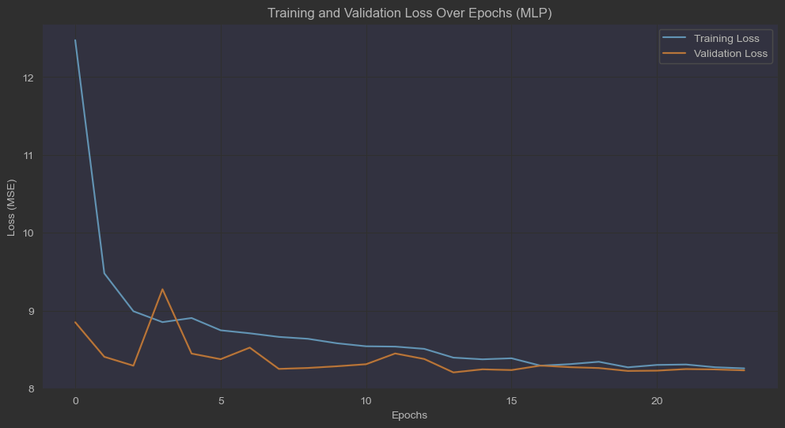

# SmartWatch Health Data - Stress Level Prediction

## Dataset
The dataset used for this project is available on Kaggle:
[Smartwatch Health Data (Uncleaned)](https://www.kaggle.com/datasets/mohammedarfathr/smartwatch-health-data-uncleaned/data)

## Overview
This project focuses on predicting stress levels based on smartwatch health data. The dataset includes various health indicators such as heart rate, blood oxygen level, step count, sleep duration, activity level, and stress level. The goal is to train a machine learning model to predict the stress level based on these input features.

## Data Preprocessing
Since the dataset was uncleaned, several preprocessing steps were necessary:

1. **Handling Missing Values:**
   - Missing values in numerical columns were filled using either the mean or median, depending on the distribution of the data.
   - The median was preferred for features with extreme outliers to prevent skewing the results.

2. **Removing Outliers:**
   - Some values in features such as heart rate and step count were significantly high, indicating possible sensor errors or unrealistic entries.
   - The median was used to impute missing values in such cases to maintain a more realistic distribution.

3. **Handling Categorical Data:**
   - The "Activity Level" column contained inconsistencies such as misspelled values (e.g., "Seddentary" instead of "Sedentary").
   - These were mapped into a numerical scale: `Sedentary = 0`, `Active = 1`, and `Highly Active = 2`.

4. **Filtering Non-Numeric Values:**
   - The "Stress Level" column contained a non-numeric value, "Very High," which could not be mapped onto the 0-10 scale.
   - These rows were removed using:
     ```python
     df = df[df['Stress Level'] != "Very High"]
     ```

5. **Converting Object Types to Numeric:**
   - Some columns were incorrectly stored as object types despite containing numeric values.
   - These were converted using `pd.to_numeric(df[column], errors='coerce')`.

## Model Training
A Multi-Layer Perceptron (MLP) neural network was trained to predict stress levels. The steps involved:

1. **Feature Scaling:**
   - Standardization using `StandardScaler()` to ensure all input features were on a similar scale.

2. **Splitting Data:**
   - The dataset was split into an 80% training set and a 20% test set using `train_test_split()`.

3. **Neural Network Architecture:**
   - A simple feed-forward neural network was built using Keras:
     ```python
     mlp = Sequential([
         Dense(256, activation='relu', input_shape=(X_train.shape[1],)),
         Dense(128, activation='relu'),
         Dropout(0.3),
         Dense(64, activation='relu'),
         Dropout(0.3),
         Dense(32, activation='relu'),
         Dense(1, activation='linear')
     ])
     ```
   - The model used the Adam optimizer and Mean Squared Error (MSE) as the loss function.

4. **Training Process:**
   - Early stopping and learning rate reduction were implemented using:
     ```python
     es = EarlyStopping(monitor='val_loss', patience=10, restore_best_weights=True)
     rlr = ReduceLROnPlateau(monitor='val_loss', factor=0.2, patience=5, min_lr=0.0001)
     ```
   - The model was trained for 50 epochs with a batch size of 32.

## Results
- The model achieved a Mean Absolute Error (MAE) of **~2.49**, which is reasonable given the stress level scale of 0 to 10.
- Training and validation loss graphs indicate a stable training process with minimal overfitting.
- 

## Future Improvements
- Collecting more balanced data across different stress levels could improve model performance.
- Experimenting with different architectures, such as LSTMs or transformers, for time-series data.
- Hyperparameter tuning to further optimize model performance.


## Conclusion
This project successfully demonstrates stress level prediction using smartwatch health data. Preprocessing was crucial in handling outliers, missing values, and categorical inconsistencies. The neural network provides reasonable predictions, but further optimization and data quality improvements could enhance accuracy.

